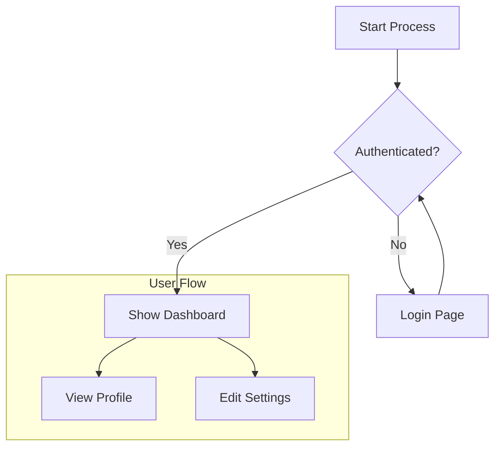

# Mermaid FigJam Suite

Professional FigJam plugin for importing and visualizing Mermaid flowchart diagrams using native FigJam elements.

## Features

✨ **Native FigJam Rendering** - Converts Mermaid flowcharts to native FigJam shapes, connectors, and frames
📦 **Subgraph Support** - Automatically creates grouped frames for Mermaid subgraphs
🎨 **Smart Sizing** - Fixed-width nodes with dynamic height based on text content
🔄 **Auto-Update** - Detects and replaces existing diagrams when re-importing
📊 **Multi-File Projects** - Organizes multiple diagrams into categorized sections

## Project structure

```
/manifest.json           – Figma manifest (Plugin)
/package.json            – npm scripts + dependencies
/tsconfig.json           – shared TS config
/shared/types.ts         – MermaidProject + message contracts
/plugin
  ├── src/main.tsx       – plugin main thread (creates native FigJam elements)
  ├── src/ui.ts          – plugin iframe UI logic (JSON import interface)
  └── ui.html            – static HTML for the UI iframe
/scripts
  ├── generate-project.js    – Generate JSON from flat folder structure
  └── generate-roomieland.js – Generate JSON from nested folder structure
/dist                    – build artifacts
```

## Installation

```bash
pnpm install
```

## Building

```bash
pnpm run build
```

Outputs are written to `dist/`.

For iterative development you can run the individual watch scripts:

- `pnpm run dev:plugin` – main thread bundle
- `pnpm run dev:ui` – UI iframe bundle

## Setting Up the Plugin in FigJam

### Step 1: Build the Plugin

```bash
pnpm run build
```

This compiles the plugin code and outputs it to the `dist/` folder.

### Step 2: Load Plugin in Figma Desktop

1. Open **Figma Desktop** application (plugin development requires the desktop app, not the web version)
2. Navigate to **Plugins** → **Development** → **Import plugin from manifest…**
3. Browse to this repository and select `manifest.json`
4. The plugin will now appear in your development plugins list

### Step 3: Use the Plugin in FigJam

1. Create or open a **FigJam file** (not a regular Figma design file)
2. Open the **Resources** panel (Shift + I or click the resources icon)
3. Go to **Plugins** → **Development** → **Mermaid FigJam Suite**
4. The plugin UI will appear with a text area for JSON input

### Step 4: Import Your Diagrams

1. **Paste JSON** directly into the text area, or
2. **Click "Choose File"** to upload a `.json` file
3. Click **"Import Project"**
4. The plugin will create native FigJam sections with your diagrams

**Note:** If you re-import the same project, existing sections will be automatically deleted and replaced with the updated diagrams.

## Using the Generator Scripts

The project includes two scripts to automatically generate JSON files from folders containing `.mmd` (Mermaid) files:

### Script 1: `generate-project.js` (Flat Structure)

Use this for projects with a simple folder structure where each subfolder contains `.mmd` files.

**Usage:**

```bash
node scripts/generate-project.js <input-folder> [options]

Options:
  -o, --output     Output JSON file path (default: output.json)
  -h, --help       Show help message
```

**Example:**

```bash
# Generate from test_mermaid folder
node scripts/generate-project.js ./test_mermaid

# Specify custom output file
node scripts/generate-project.js ./test_mermaid -o my-diagrams.json
```

**Folder Structure Example:**
```
test_mermaid/
├── authentication/
│   ├── login.mmd
│   └── signup.mmd
└── workflows/
    └── checkout.mmd
```

### Script 2: `generate-roomieland.js` (Nested Structure)

Use this for deeply nested projects. It scans first-level subfolders and recursively finds all `.mmd` files, creating a flattened output.

**Usage:**

```bash
node scripts/generate-roomieland.js <input-folder> [options]

Options:
  -o, --output     Output JSON file path (default: roomieland.json)
  -h, --help       Show help message
```

**Example:**

```bash
# Generate from roomieland-design folder
node scripts/generate-roomieland.js ~/Documents/roomieland-design

# Specify custom output
node scripts/generate-roomieland.js ~/Documents/roomieland-design -o project.json
```

**Folder Structure Example:**
```
roomieland-design/
├── admin/
│   └── Mermaid/
│       └── admin_currencies.mmd    # Found recursively
├── users/
│   ├── user_profile.mmd
│   └── auth/
│       └── user_login.mmd          # Found recursively
└── workflows/
    └── checkout.mmd
```

**Output:** All `.mmd` files are grouped by their top-level folder (category):
```json
{
  "admin": {
    "admin_currencies.mmd": { ... }
  },
  "users": {
    "user_profile.mmd": { ... },
    "user_login.mmd": { ... }
  }
}
```

### What the Scripts Do

Both scripts:
1. 📂 Find all `.mmd` files in the specified directory
2. 🔍 Parse Mermaid flowchart syntax to extract:
   - Nodes with their types (rectangle, diamond, circle, etc.)
   - Edges with labels and styles
   - Subgraphs with titles and grouped nodes
   - Layout direction (TD, LR, RL, BT)
3. 📐 Calculate node positions using a layered layout algorithm
4. 💾 Generate a JSON file ready to import into FigJam

## JSON Format

The generated JSON follows this TypeScript interface:

```ts
interface MermaidNode {
  id: string;
  text: string;
  type: 'rectangle' | 'stadium' | 'diamond' | 'circle' | 'subroutine' | 'cylinder' | 'hexagon' | 'asymmetric';
  x: number;
  y: number;
  width: number;
  height: number;
}

interface MermaidEdge {
  from: string;
  to: string;
  label: string;
  style: 'solid' | 'dotted' | 'thick';
}

interface MermaidSubgraph {
  id: string;
  title: string;
  nodes: string[];  // Node IDs in this subgraph
  x: number;
  y: number;
  width: number;
  height: number;
}

interface MermaidFile {
  code: string;  // Original Mermaid code
  direction?: 'TD' | 'TB' | 'LR' | 'RL' | 'BT';
  nodes?: MermaidNode[];
  edges?: MermaidEdge[];
  subgraphs?: MermaidSubgraph[];
}

interface MermaidProject {
  [folderName: string]: {
    [fileName: string]: MermaidFile;
  };
}
```

**Simple Example:**

```json
{
  "Authentication": {
    "login.mmd": {
      "code": "graph TD\nA[Start]-->B[Login]\nB-->C[Dashboard]",
      "direction": "TD",
      "nodes": [
        { "id": "A", "text": "Start", "type": "rectangle", "x": 0, "y": 0, "width": 150, "height": 60 },
        { "id": "B", "text": "Login", "type": "rectangle", "x": 0, "y": 160, "width": 150, "height": 60 }
      ],
      "edges": [
        { "from": "A", "to": "B", "label": "", "style": "solid" }
      ]
    }
  }
}
```

## How It Works

### Plugin Workflow

1. **User Input**: The UI iframe accepts pasted JSON or a `.json` file upload
2. **Data Transfer**: The JSON data is sent to the main plugin thread via `figma.ui.postMessage()`
3. **Duplicate Detection**: The plugin checks for existing sections with matching folder/file names and removes them
4. **Section Creation**: For each folder in the JSON:
   - Creates a top-level **Section** for the folder (category)
   - Creates nested **file Sections** within that folder
5. **Diagram Rendering**: For each Mermaid file, the plugin creates:
   - **Subgraph Frames**: Light purple bordered frames with titles for each `subgraph` block
   - **Shape Nodes**: Native FigJam shapes (rectangles, diamonds, circles, etc.) with:
     - Fixed width (200px)
     - Dynamic height based on text content
     - Color-coded by node type
     - Purple stroke borders
   - **Connectors**: Arrows connecting nodes from bottom to top (vertical flow)
   - **Edge Labels**: Text on connectors when specified
6. **Layout**: The plugin positions elements with generous padding and automatically scrolls/zooms to the new content

### Native FigJam Elements Used

- **Sections**: Organize diagrams by folder and file
- **Frames**: Group nodes within subgraphs
- **ShapeWithText**: Display nodes with various shapes (rectangle, diamond, ellipse, etc.)
- **Connectors**: Show relationships between nodes with arrows
- **Text**: Display titles and labels

### Supported Mermaid Syntax

**Flowchart/Graph Types:**
- `graph TD` / `flowchart TD` - Top-down (default)
- `graph LR` - Left-to-right
- `graph RL` - Right-to-left
- `graph BT` - Bottom-to-top

**Node Shapes:**
- `A[text]` - Rectangle
- `A(text)` - Rounded rectangle (stadium)
- `A{text}` - Diamond
- `A((text))` - Circle
- `A[[text]]` - Subroutine (rectangle with double borders)
- `A[(text)]` - Cylinder
- `A{{text}}` - Hexagon
- `A>text]` - Asymmetric

**Edges:**
- `A --> B` - Solid arrow
- `A --- B` - Solid line
- `A -.-> B` - Dotted arrow
- `A ==> B` - Thick arrow
- `A -->|label| B` - Arrow with label

**Subgraphs:**
```mermaid
subgraph "Title"
    A --> B
    B --> C
end
```

## Quick Start Example

1. **Create a Mermaid file** (`example.mmd`):


2. **Generate JSON**:
```bash
# Create folder structure
mkdir -p my-diagrams/workflows
mv example.mmd my-diagrams/workflows/

# Generate JSON
node scripts/generate-project.js my-diagrams -o my-diagrams.json
```

3. **Import to FigJam**:
   - Open FigJam
   - Run the plugin
   - Upload `my-diagrams.json`
   - Click "Import Project"

## Development

### Watch Mode

For iterative development:

```bash
# Watch plugin main thread
pnpm run dev:plugin

# Watch UI iframe
pnpm run dev:ui
```

After making changes, reload the plugin in FigJam to see updates.

### Project Structure Details

- **`plugin/src/main.tsx`**: Main plugin logic - creates FigJam elements
- **`plugin/src/ui.ts`**: UI logic - handles JSON upload/paste
- **`plugin/ui.html`**: Plugin UI interface
- **`shared/types.ts`**: TypeScript interfaces shared between plugin and UI
- **`scripts/*.js`**: Node.js scripts for generating JSON from `.mmd` files

## Troubleshooting

**Plugin doesn't appear in FigJam:**
- Make sure you're using Figma Desktop (not web)
- Verify you're in a FigJam file (not a regular Figma design file)
- Check that the plugin was imported from the correct `manifest.json`

**Diagrams not rendering:**
- Verify your JSON structure matches the expected format
- Check the browser console for error messages
- Ensure your `.mmd` files use supported Mermaid syntax (flowchart/graph only)

**Text is cut off:**
- The plugin uses dynamic height calculation - if text is still cut off, it may be a very long label
- Consider breaking long labels into multiple shorter lines in your Mermaid code

**Existing diagrams not updating:**
- The plugin automatically deletes sections with matching names
- Make sure folder/file names in your JSON match the existing section names exactly
